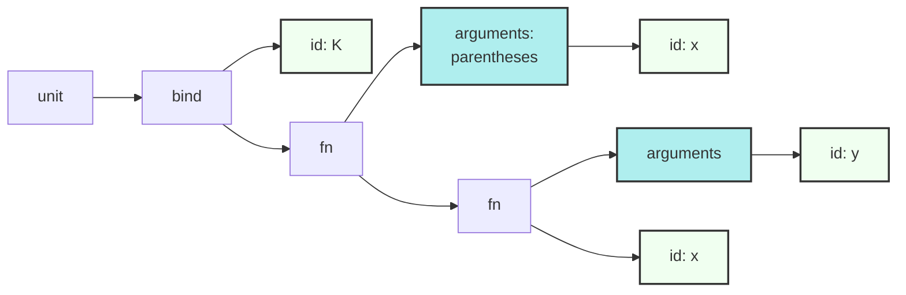
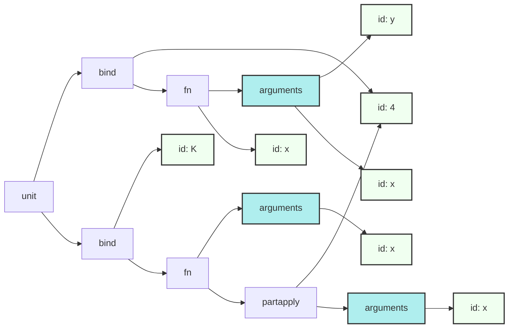

# Progress Update 9th Nov 2025

## Summary

This weekend I have reached the point where closures are transformed into top-level functions that are _partially applied_ to the values being closed over. There's quite a lot of unpack here, so let's break it down.

## Example

One of the simplest examples of a closure is the K combinator, a staple of functional programming. `K(x)` delivers a closure that when applied to anything, discards it and returns `x`. It's not useful itself, of course, but is a common "re-plumbing" function. We will use it to illustrate the key change.

Here's how it might be defined in Nutmeg.

```
def K(x):
    fn y: x end
end
```

After parsing we get a tree that looks like this:



That inner function will become a closure, capturing the value of `x`. As part
of the transformation into a canonical form we want to lift that inner function
to the top-level. The new nutmeg-resolver command does exactly that, with this
result.

```xml
<unit>
  <bind>
    <id const="true" name="4" no="4" scope="unit" var="false" />
    <fn syntax="surround">
      <arguments>
        <id const="false" name="y" no="2" scope="inner" var="false" />
        <id const="false" name="x" no="3" scope="inner" var="false" />
      </arguments>
      <id const="false" last="true" name="x" no="3" scope="outer" var="false" />
    </fn>
  </bind>
  <bind syntax="surround">
    <id const="false" name="K" no="0" protected="true" scope="global" var="false" />
    <fn>
      <arguments kind="parentheses">
        <id const="false" name="x" no="1" scope="outer" var="false" />
      </arguments>
      <partapply>
        <id const="true" name="4" no="4" scope="unit" var="false" />
        <arguments>
          <id const="false" name="x" no="1" scope="inner" var="false" />
        </arguments>
      </partapply>
    </fn>
  </bind>
</unit>
```

And graphically like this:



## What's Going On Here?

### Basic Idea

To recap: a closure is a lambda function that refers to _local_ variables that  belong to an enclosing scope. We say that these variables are "captured" by the closure. Closures are a powerful feature of functional programming but are tricky to implement efficiently. But the technique employed here is reasonably efficient and fairly easy to understand.

The key idea is to eliminate closures in favour of the easy-to-implement partial-application. Partial application takes a function-object F and some values and creates a tiny function-object that when called, pushes the values onto the value stack and then invokes the original F.

To transform a lambda function C, that happens to be a closure, into a partial application, we add the captured variables as extra parameters. In our little `K` example that means we go from:

```
def K(x):
    fn y: x end
end
```

to the intermediate - and briefly incorrect:

```
def K(x):
    fn (y, x): x end
end
```

And then we correct this by using our `partApply` function to ensure that the
inner `x` will bind to the required value.

```
def K(x):
    fn (y, x): x end.partApply(
      x  ### This `x` belongs to K, not the inner function.
    )
end
```

Importantly the inner lambda (`fn`) no longer captures any variables because we made all the captured variables locals and then explicitly captured them with `partApply`. So it is now safe to move to the top-level, binding it to a newly introduced constant.

### Points to Note

- In the generated code shown above the `partapply` node is not an ordinary function call but a dedicated form. This gives the engine a little help in picking them out to apply some simple optimisations. But it could easily have been surfaced as a system call (`syscall`) instead.

- If you are familiar with this kind of transformation, you are probably asking what happens if the captured variable is mutable (i.e. `var`). In Nutmeg we forbid that scenario to nudge programmers, as part of Nutmeg's learning-by-doing ethos, into more functional styles of programming. We go into the implications of this decision in the next section.

- The newly introduced variables are at the same level as globals but are deemed to exist in their own "UnitScope" and are only accessible in this unit (i.e. file). This is the mechanism used to avoid possible name clashes. The serial numbering reflects this too.

- If you are wondering how to implement partial-application for Nutmeg, it requires a little bit of dynamic code generation. I usually defer implementing it until I have the code generator sorted out.


## Achieving the effect of var-capture

It is, of course, legitimate to want the effect of var-capture e.g. to provide an `iota` like function:

```
def iota():
    var n := 0
    fn (): 
        n   ### But this is not allowed, as `n` is `var`.
        n <- n + 1
    end
end
```

The workaround is that Nutmeg provides "hard" references for exactly this scenario. You can create these with `Ref(value)` and access/update their contents with `cont`. It's more awkward - but not exceptionally awkward.

```
def iota():
    n = Ref(0)
    fn (): 
        n.cont
        n.cont <-- n.cont + 1  ### Note the long-arrow!!
    end
end
```

Assigning to a var only needs one arrow. But updating an object is considered to be different and we demand it is signalled with a long arrow. And this is the _real_ reason that var-capture is disallowed - to force the use of long-arrows, which signal the presence of updates that can persist beyond the lexical scope!

In languages where var-capture is permitted, the resolver phase would also need to automatically promote the captured variables to hard-references. But in our case we only need to capture values.
